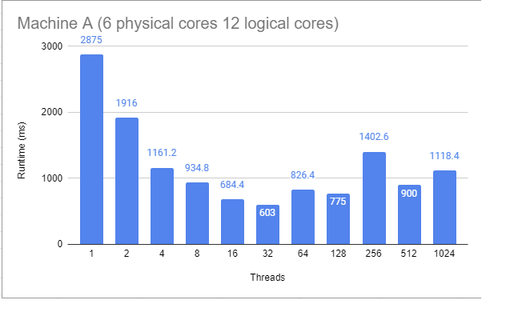

# STDISCM Prime Checker

A simple prime checker that uses threading and mutex locks.

## Getting Started
1. Install Visual Studio 2022 Community with the latest C++ [here](https://visualstudio.microsoft.com/vs/)
2. Once installed, open the program the Visual Studio 2022 Community
3. Run the program

## Results
Specs: Processor	AMD Ryzen 5 5600H with Radeon Graphics, 3301 Mhz, 6 Core(s), 12 Logical Processor(s)

We can see from this trend that increasing the thread count decreases the runtime of the program up to a certain point. Adding more threads causes the processor to do more context switching rather than processing.
`